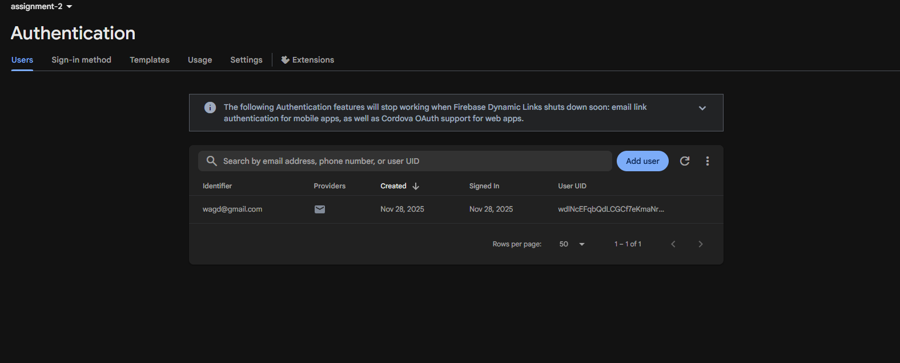
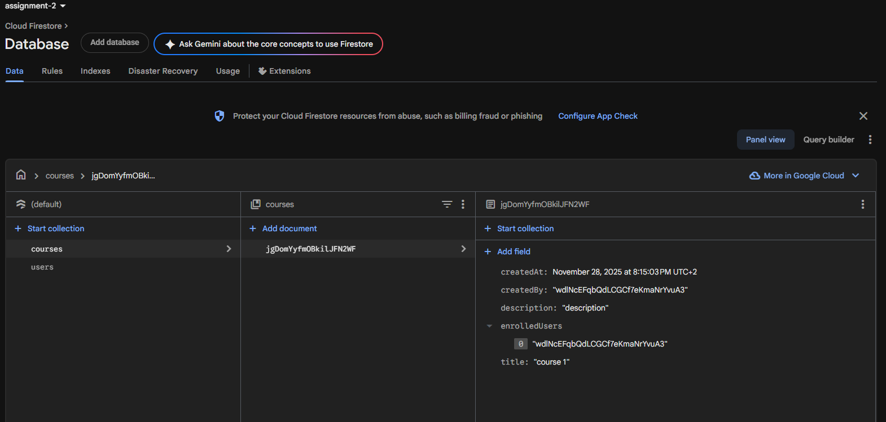

# Assignment 2 – Firebase (Flutter)

A simple Flutter app that allows a student to:

1. Register and log in using **Firebase Authentication**.  
2. Store their profile in the **`users`** collection in **Cloud Firestore**.  
3. View a list of courses from the **`courses`** collection.  
4. Enroll in a course (the user ID is stored in the course document).  
5. Add new courses from the app.

---

## Features

### 1. User Authentication

- **Register Screen**
  - Fields: `Name`, `Email`, `Password`
  - On successful registration:
    - Creates a new user in Firebase Authentication.
    - Uses the generated **UID** to store user information in `users` collection.

- **Login Screen**
  - Existing users can log in with their email and password.
  - On success, the user is redirected to the **Courses** screen.

### 2. Firestore Database

- **Users Collection**
  - Each document ID is the user’s `uid`.
  - Example fields:
    - `name`
    - `email`
    - `createdAt`

- **Courses Collection**
  - Each document represents a course.
  - Example fields:
    - `title`
    - `description`
    - `createdBy` (uid of the user who created the course)
    - `enrolledUsers` (array of user UIDs)
    - `createdAt`

### 3. Courses Screens

- **Enrolled Courses Screen**
  - Shows all courses retrieved from Firestore.
  - Each item displays:
    - Course title
    - Course description
  - An **Enroll** button adds the current user’s UID to `enrolledUsers`.

- **Add New Course Screen**
  - Allows the user to create a new course.
  - Fields: `Course title`, `Description`
  - Saves a new document in the `courses` collection.

---

## Project Structure (Main Files)

- `lib/main.dart`
  - Initializes Firebase and sets up routes.
- `lib/register_screen.dart`
  - Registration form and saving user profile to Firestore.
- `lib/login_screen.dart`
  - Login form and authentication flow.
- `lib/courses_screen.dart`
  - Lists courses from Firestore and handles enrollment.
- `lib/add_course_screen.dart`
  - Form to add a new course.
- `pubspec.yaml`
  - Flutter and Firebase dependencies.

---

## Technologies Used

- **Flutter**
- **Dart**
- **Firebase Authentication**
- **Cloud Firestore**

Main dependencies (see `pubspec.yaml`):

- `firebase_core`
- `firebase_auth`
- `cloud_firestore`

---

## Screenshots

### App Screens

#### **Register Screen:** 

#### **Login Screen:** 

#### **Empty Courses Screen:** 

#### **Add New Course Screen:** 

#### **Courses List with Enroll Button:** 

---

### Firebase Console

**Authentication – Users**

**Cloud Firestore – `users` and `courses` Collections**

---

